# 🏨 Hotel Bookings Analytics Platform

<div align="center">


**A complete, end-to-end hotel analytics pipeline: data cleaning → EDA → SQL → ML → explainability → interactive dashboard → AI-powered insights.**

[🚀 Quick Start](#setup-instructions) · [📊 Dashboard](#dashboard-phases-7--8) · [🤖 ML Model](#machine-learning-phase-5) · [💡 AI Insights](#ai-insights-phase-8)

</div>

---

## 📸 Screenshots

### 📊 Overview Tab — KPI Tiles & Yearly Trends
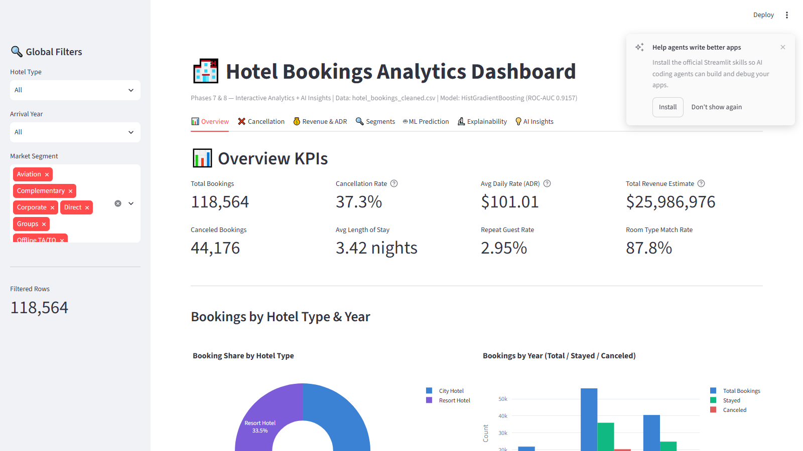

### ❌ Cancellation Analysis Tab
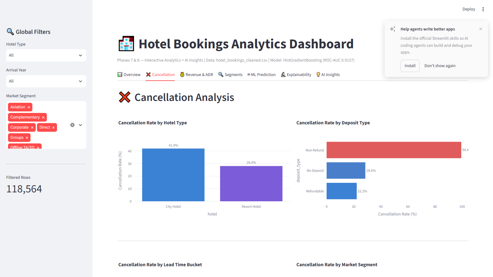

### 💰 Revenue & ADR Tab
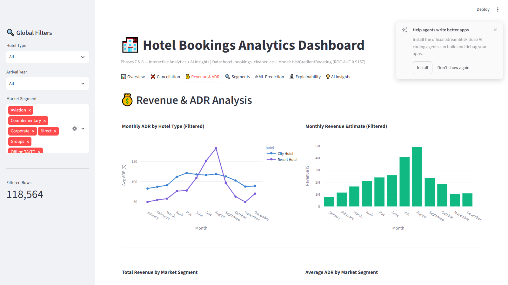

### 🔍 Market Segments Tab
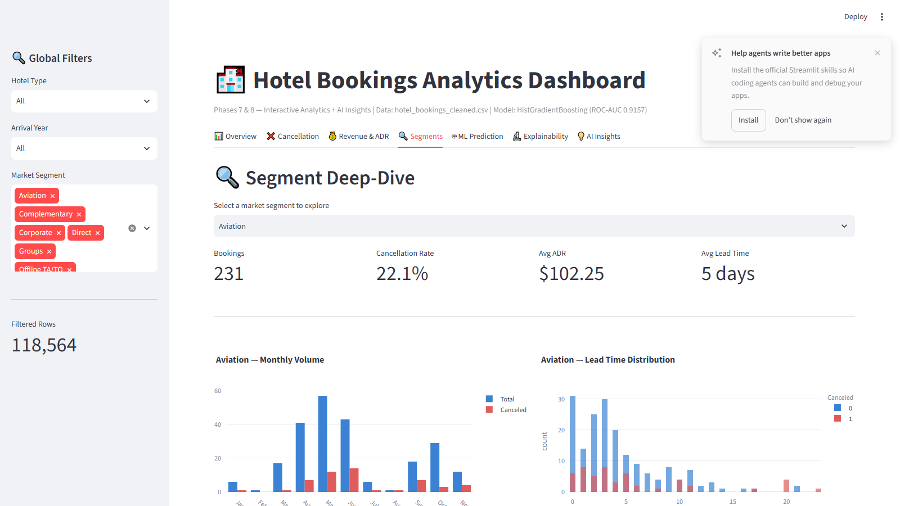

### 🤖 ML Prediction Tab — Live Cancellation Probability
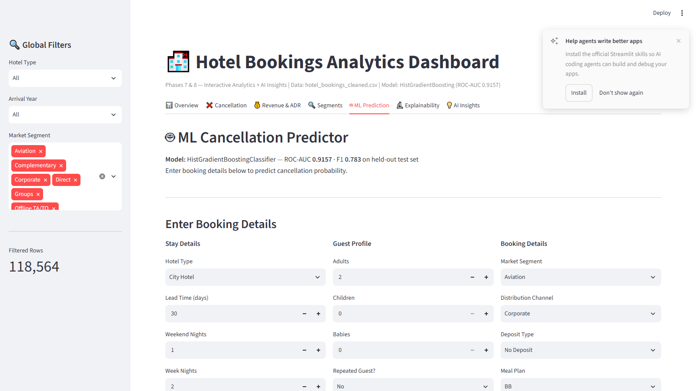

The interactive prediction form lets users input booking details and get a real-time cancellation probability gauge:

| Prediction Form | Result |
|:-:|:-:|
|  | 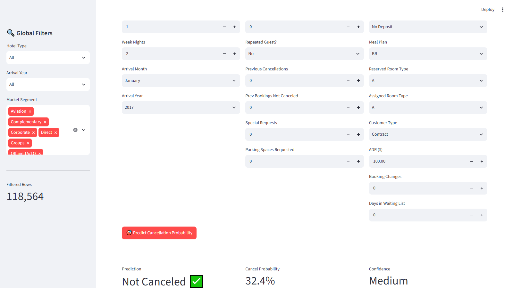 |

### 🔬 Model Explainability Tab — SHAP & Feature Importance
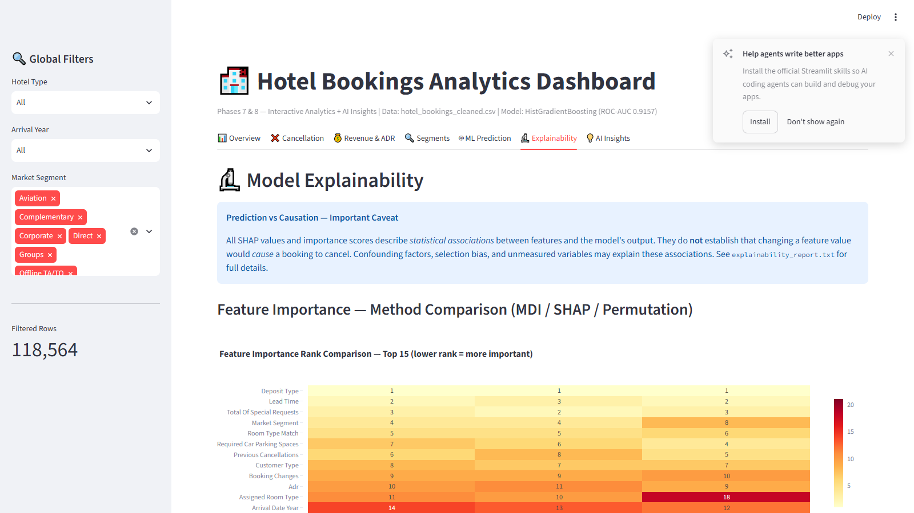

### 💡 AI Insights Tab — GPT-Powered Natural Language Analysis
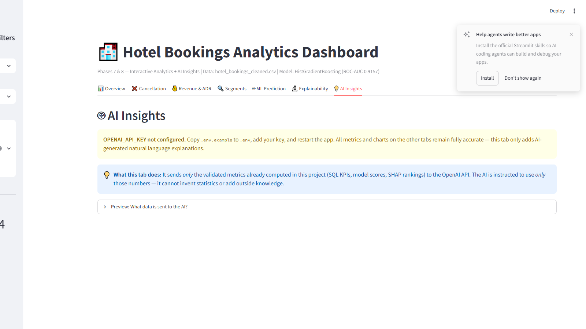

### 🔘 Sidebar Filters — Hotel Type, Year & Segment
| City Hotel Filter | Resort Hotel Filter | Year 2016 Filter |
|:-:|:-:|:-:|
| 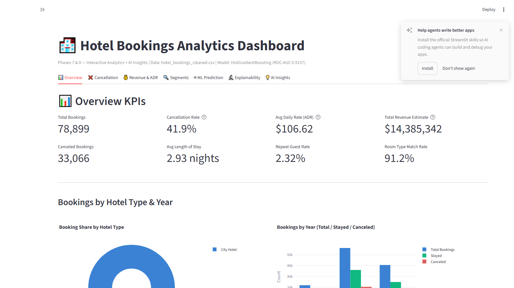 | 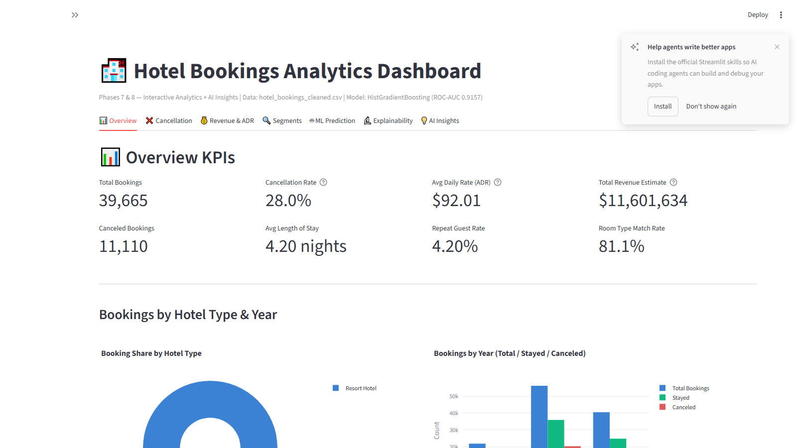 | 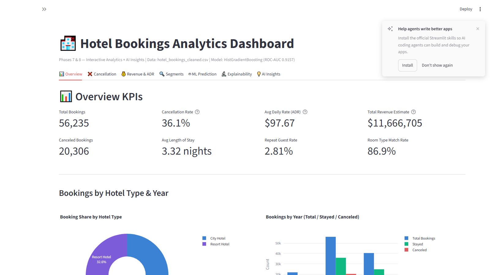 |

---

## 📑 Table of Contents

1. [Dataset](#-dataset)
2. [Objective](#-objective)
3. [Project Structure](#-project-structure)
4. [Setup Instructions](#-setup-instructions)
5. [Running the Pipeline](#-running-the-pipeline)
6. [Data Preparation (Phase 2)](#-data-preparation-phase-2)
7. [EDA & KPIs (Phase 3)](#-eda--kpis-phase-3)
8. [SQL Analytics (Phase 4)](#-sql-analytics-phase-4)
9. [Machine Learning (Phase 5)](#-machine-learning-phase-5)
10. [Model Explainability (Phase 6)](#-model-explainability-phase-6)
11. [Dashboard (Phases 7 & 8)](#-dashboard-phases-7--8)
12. [AI Insights (Phase 8)](#-ai-insights-phase-8)
13. [Testing (Phase 9)](#-testing-phase-9)
14. [Key Results Summary](#-key-results-summary)
15. [Limitations](#-limitations)

---

## 📂 Dataset

| Property | Value |
|---|---|
| **File** | `hotel_bookings.csv` |
| **Source** | Antonio, Almeida & Nunes (2019) — [Hotel booking demand datasets](https://www.kaggle.com/datasets/jessemostipak/hotel-booking-demand) |
| **Rows** | 119,390 raw / **118,564 cleaned** |
| **Columns** | 32 raw / **42 after feature engineering** |
| **Date Range** | July 2015 – August 2017 |
| **Hotel Types** | City Hotel (66.5%), Resort Hotel (33.5%) |

The dataset contains one row per hotel booking. Each row records hotel type, booking date, guest details, room type, ADR, meal plan, market segment, deposit type, reservation status, and more.

---

## 🎯 Objective

The primary business objective is **predicting hotel booking cancellations** (`is_canceled`) at the time of booking — before check-in — using only features available at booking creation. Secondary objectives include revenue trend analysis, customer segmentation, and surfacing actionable insights for hotel operations.

---

## 🗂️ Project Structure

```
hotel-bookings-analytics-platform/
│
├── hotel_bookings.csv              # Raw dataset (do not modify)
├── hotel_bookings_cleaned.csv      # Cleaned, feature-engineered dataset
│
├── data_cleaning.py                # Phase 2: cleaning pipeline
├── eda_analysis.py                 # Phase 3: EDA + KPI charts
├── hotel_queries.sql               # Phase 4: 20 SQL analytical queries
├── sql_analytics.py                # Phase 4: SQL runner + cross-validator
├── ml_pipeline.py                  # Phase 5: ML training + evaluation
├── explainability.py               # Phase 6: SHAP + permutation + PDP
├── dashboard.py                    # Phase 7+8: Streamlit dashboard
├── ai_insights.py                  # Phase 8: AI integration layer
│
├── requirements.txt                # Pinned dependencies
├── .env.example                    # API key template
├── PREPROCESSING_DECISIONS.md      # Documented cleaning decisions
│
├── plots/                          # All generated charts (PNG, 33 total)
├── dashboard_screenshots/          # Dashboard UI screenshots (14 PNG)
├── models/                         # Trained model artifacts
├── sql_results/                    # SQL query result CSVs (20 files)
├── tests/                          # pytest test suite (73 tests)
│
├── cleaning_report.txt             # Per-step audit log
├── kpi_report.txt                  # KPI output from EDA
├── sql_results_report.txt          # Full SQL results report
├── ml_report.txt                   # ML evaluation report
└── explainability_report.txt       # Explainability findings
```

---

## ⚙️ Setup Instructions

### 1. Prerequisites

- Python 3.10+
- pip

### 2. Clone the Repository

```bash
git clone https://github.com/chirag2005dv/hotel-bookings-analytics-platform.git
cd hotel-bookings-analytics-platform
```

### 3. Install Dependencies

```bash
pip install -r requirements.txt
```

### 4. Configure AI Insights (optional)

```bash
cp .env.example .env        # macOS/Linux
copy .env.example .env      # Windows
```

Edit `.env` and add your OpenAI API key:
```
OPENAI_API_KEY=sk-...your-key-here...
```

> The dashboard and all other scripts work fully without a key — the AI Insights tab will display a helpful message but all other analytics remain available.

---

## 🚀 Running the Pipeline

Run phases in order. Each phase is independent and idempotent.

```bash
# Phase 2 — Data Cleaning
python data_cleaning.py

# Phase 3 — EDA & KPIs
python eda_analysis.py

# Phase 4 — SQL Analytics
python sql_analytics.py

# Phase 5 — Machine Learning
python ml_pipeline.py

# Phase 6 — Explainability
python explainability.py

# Phase 7+8 — Dashboard (launches browser)
streamlit run dashboard.py

# Phase 9 — Tests
python -m pytest tests/ -v
```

---

## 🧹 Data Preparation (Phase 2)

**Script:** `data_cleaning.py`
**Documentation:** `PREPROCESSING_DECISIONS.md`

| Step | Action | Impact |
|---|---|---|
| NULL string replacement | 129,421 `"NULL"` literals → real NaN | agent, company, country |
| Type casting | All 32 columns → correct dtypes | Int64, float64, category, datetime |
| Missing value fill | country→`"Unknown"`, agent/company→`"0"`, children→`0` | 0 nulls remaining |
| Invalid row removal | Zero-night (715), zero-guest (110), negative ADR (1) | 826 rows removed |
| Outlier flagging | 3 binary flag columns added | Non-destructive |
| Feature engineering | 7 new columns: `total_nights`, `arrival_date`, `room_type_match`, `is_high_season`, `revenue_estimate`, `total_guests`, `arrival_month_num` | 42 total columns |

**Final dataset:** 118,564 rows × 42 columns, 0 nulls.

---

## 📈 EDA & KPIs (Phase 3)

**Script:** `eda_analysis.py` | **Report:** `kpi_report.txt`

### Core KPIs

| KPI | Value |
|---|---|
| Overall Cancellation Rate | **37.26%** |
| Average Daily Rate (stayed) | **$101.01** |
| Total Revenue Estimate | **$25,986,976** |
| Average Lead Time | 104.5 days |
| Average Length of Stay | 3.42 nights |
| Repeat Guest Rate | 2.95% |
| Room Type Match Rate | 87.81% |
| Peak Month | August |

### Key EDA Findings

- **City Hotel cancels at 41.9%** vs Resort Hotel at 28.0%
- Cancellation rises monotonically with lead time: 9.7% (same-week) → 67.7% (365d+)
- Online TA is the largest segment (47.3% of bookings) with 36.9% cancellation
- Resort Hotel ADR peaks in July–August ($152–$183); City Hotel is more stable
- August is peak month by volume; January is lowest

### Sample EDA Charts

| Cancellation by Hotel | Monthly ADR Trends | Volume by Segment |
|:-:|:-:|:-:|
| 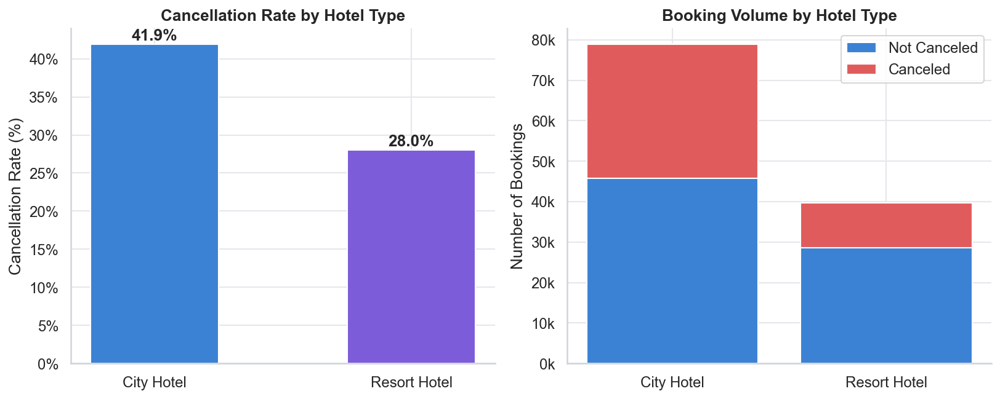 | 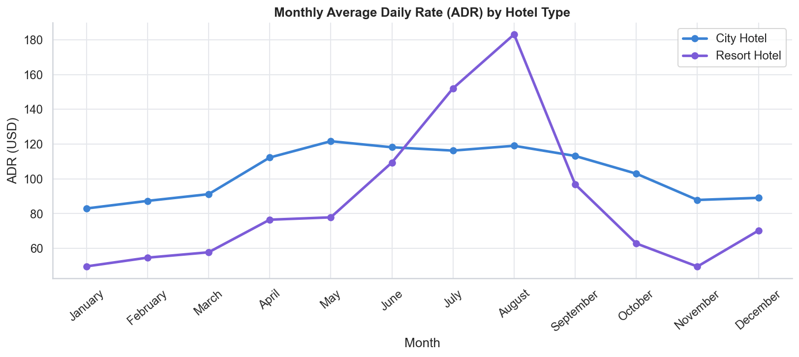 | 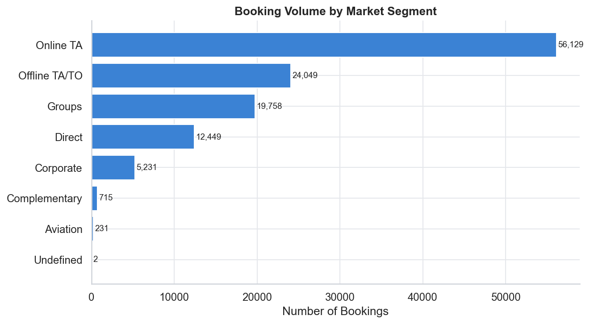 |

| Lead Time Distribution | Monthly Bookings & Cancel Rate | Top Countries |
|:-:|:-:|:-:|
| 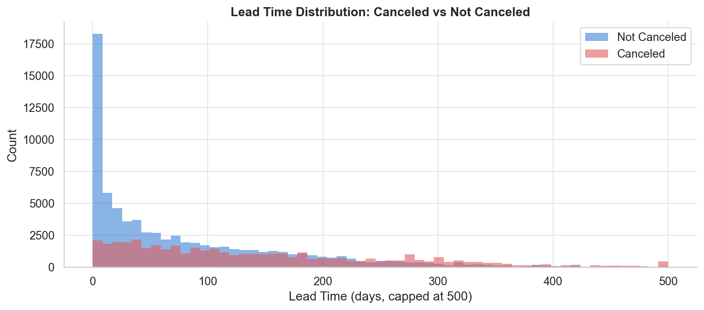 | 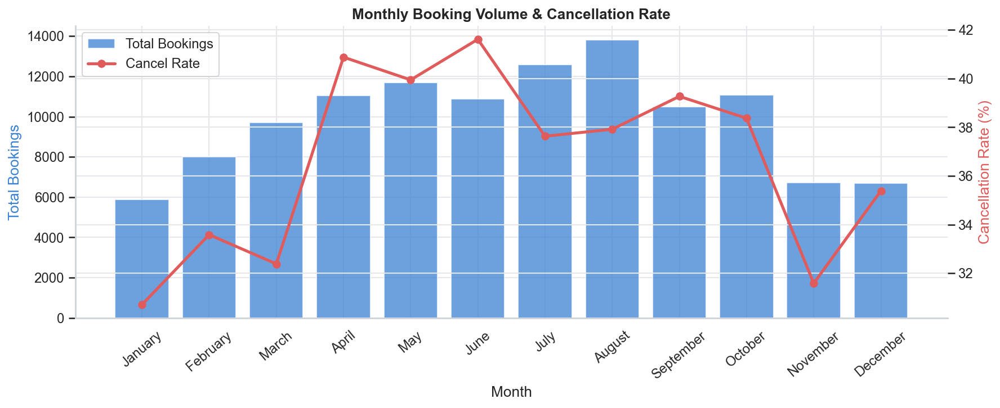 | 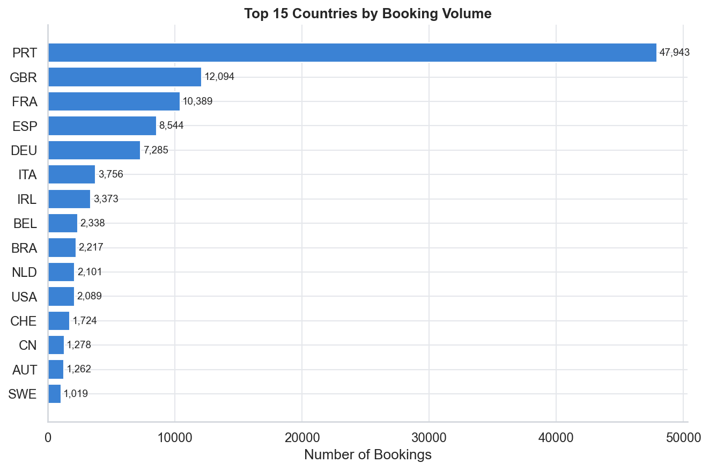 |

---

## 🗄️ SQL Analytics (Phase 4)

**Query library:** `hotel_queries.sql` | **Runner:** `sql_analytics.py` | **Engine:** SQLite

20 annotated queries covering:

| Query | Business Question |
|---|---|
| Q01 | Core KPI snapshot (single-row summary) |
| Q02–Q06 | Cancellation by hotel, segment, deposit type, lead time, customer type |
| Q07–Q08 | Revenue & ADR by segment; monthly ADR by hotel |
| Q09–Q10 | Monthly booking volume; year-over-year trends |
| Q11–Q12 | Top 15 countries; distribution channel performance |
| Q13–Q15 | Length of stay; repeat vs new guest; room assignment analysis |
| Q16–Q18 | Deposit revenue impact; lead-time vs revenue; special requests |
| Q19–Q20 | Year × month heatmap grid; high-value segment (top 10%) |

All Q01 KPIs cross-validated against Phase 3 results with zero diff.

---

## 🤖 Machine Learning (Phase 5)

**Script:** `ml_pipeline.py` | **Report:** `ml_report.txt`

Binary classification: predict `is_canceled` at booking time using 31 features.

### Model Results (23,713-row test set, stratified 80/20 split)

| Model | Accuracy | Precision | Recall | F1 | ROC-AUC | CV ROC-AUC |
|---|---|---|---|---|---|---|
| Logistic Regression | 0.7764 | 0.6884 | 0.7305 | 0.7088 | 0.8550 | 0.8534±0.0018 |
| Random Forest | 0.8414 | 0.7941 | 0.7753 | 0.7846 | 0.9149 | 0.9126±0.0021 |
| **Gradient Boosting ✓** | **0.8359** | **0.7712** | **0.7957** | **0.7832** | **0.9157** | **0.9136±0.0021** |

**Best model:** `HistGradientBoostingClassifier` — saved to `models/best_model.pkl`

### ML Evaluation Charts

| ROC Curves | Feature Importance | Model Comparison | Confusion Matrices |
|:-:|:-:|:-:|:-:|
| 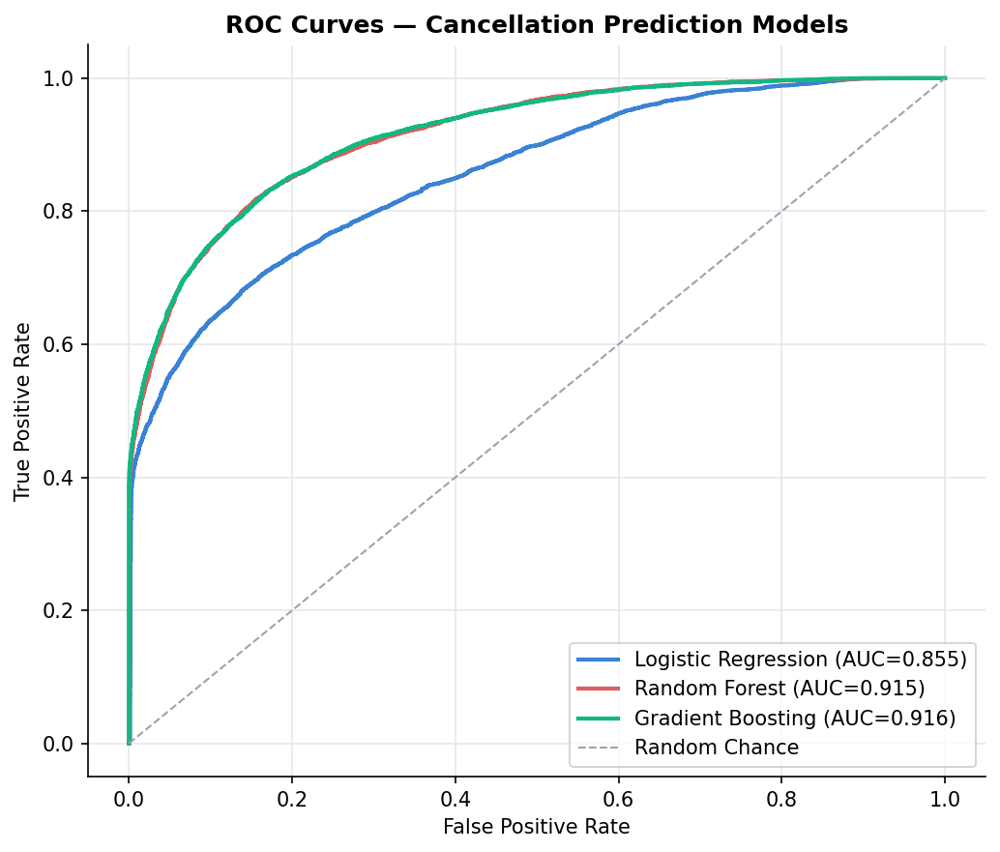 | 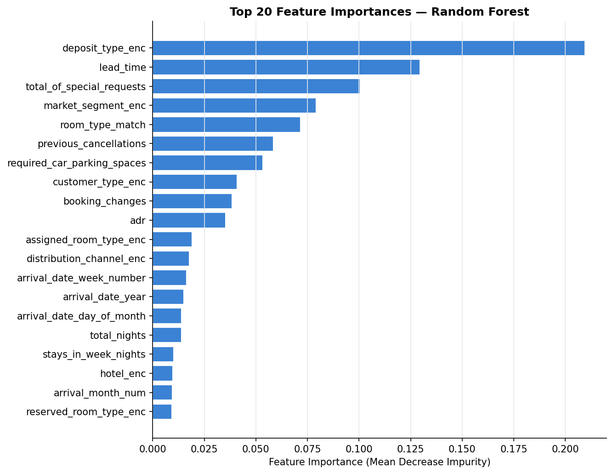 | 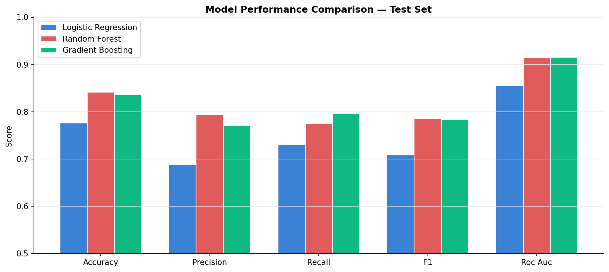 | 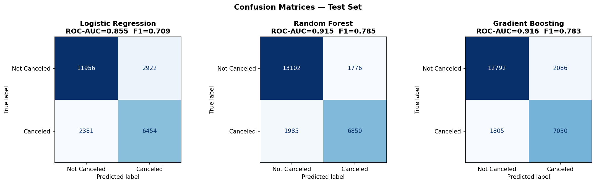 |

### Top Features (MDI Importance)

| Rank | Feature | Importance |
|---|---|---|
| 1 | Deposit Type | 20.9% |
| 2 | Lead Time | 12.9% |
| 3 | Total Special Requests | 10.0% |
| 4 | Market Segment | 7.9% |
| 5 | Room Type Match | 7.2% |

---

## 🔬 Model Explainability (Phase 6)

**Script:** `explainability.py` | **Report:** `explainability_report.txt`

| Technique | Model | Purpose |
|---|---|---|
| SHAP TreeExplainer | Random Forest | Individual + global feature contributions |
| Permutation Importance | HistGBM (best) | Model-agnostic, unbiased importance |
| Partial Dependence Plots | HistGBM (best) | Marginal feature effect on cancel probability |

### Consensus Feature Ranking

| Rank | Feature | Avg Rank |
|---|---|---|
| 1 | Deposit Type | 1.0 |
| 2 | Lead Time | 2.3 |
| 3 | Total Special Requests | 2.7 |
| 4 | Market Segment | 5.3 |
| 5 | Room Type Match | 5.3 |
| 6 | Required Car Parking Spaces | 5.7 |
| 7 | Previous Cancellations | 6.3 |

### Explainability Charts

| SHAP Summary (Beeswarm) | SHAP Summary (Bar) | Permutation Importance |
|:-:|:-:|:-:|
| 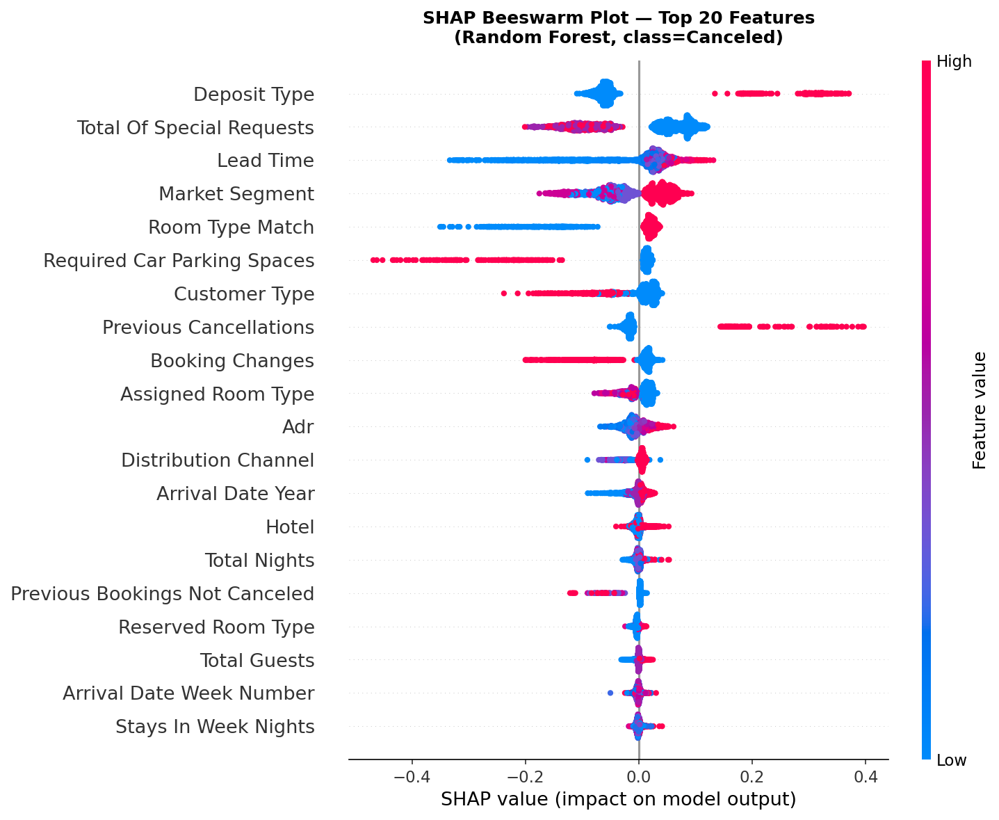 | 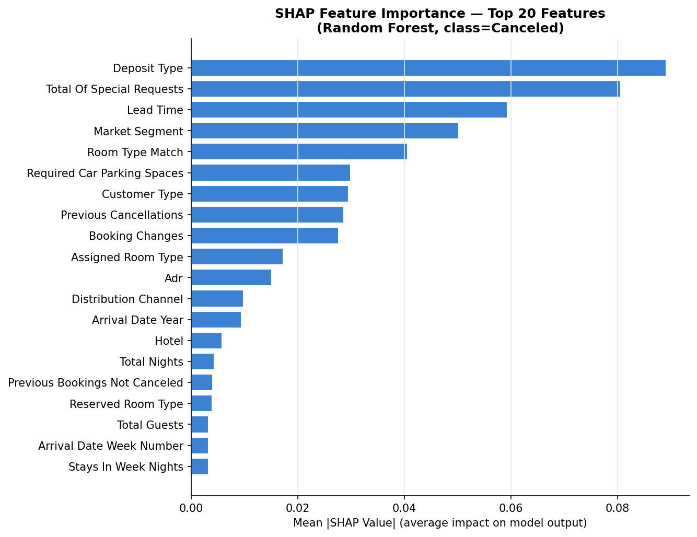 | 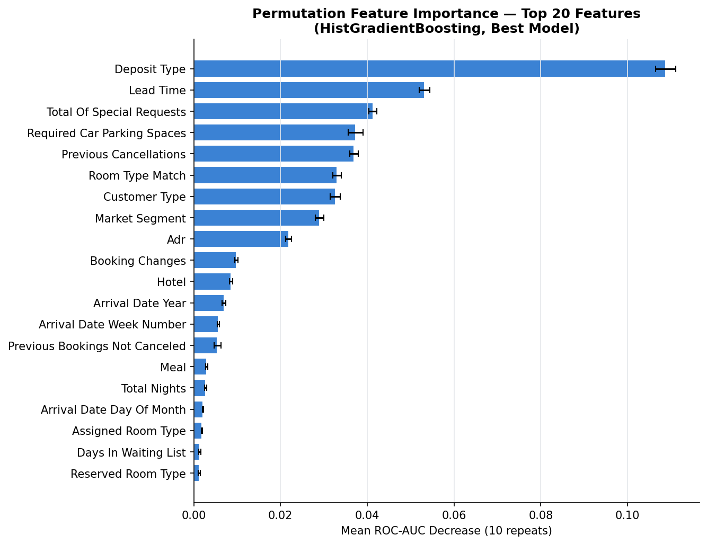 |

| SHAP Waterfall (Cancellation) | SHAP Waterfall (No Cancel) | Partial Dependence |
|:-:|:-:|:-:|
| 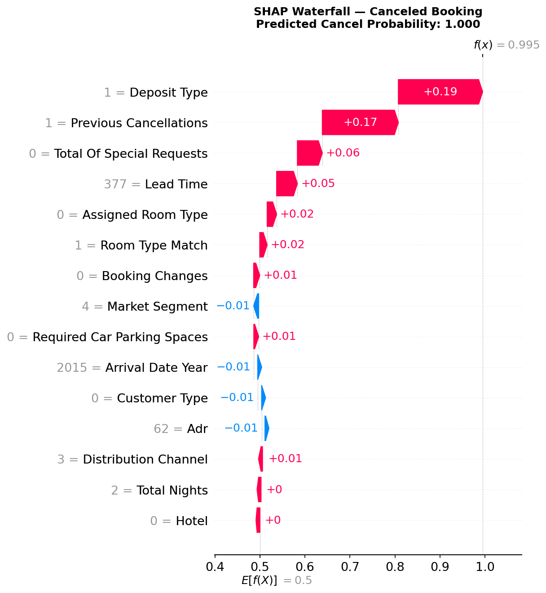 | 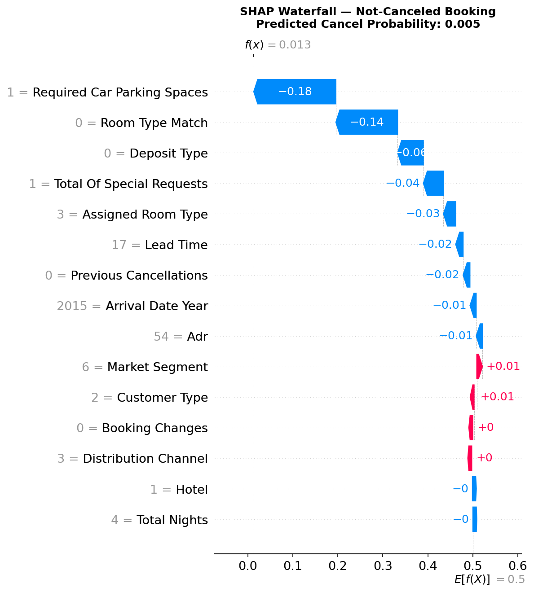 | 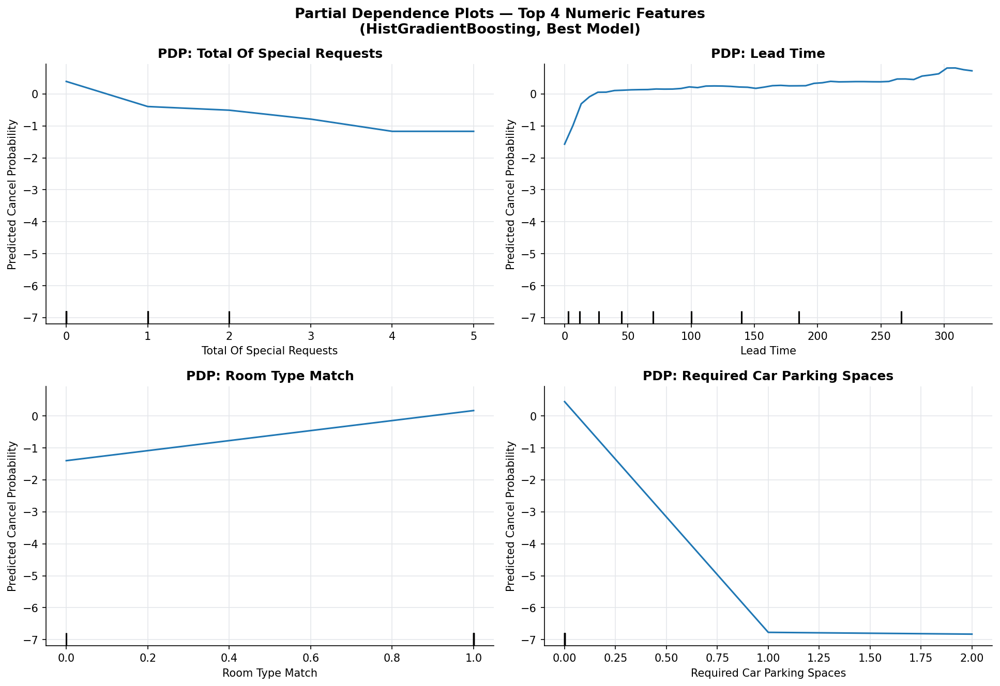 |

> ⚠️ **Prediction vs Causation:** All importance scores describe statistical associations, not causal relationships.

---

## 📊 Dashboard (Phases 7 & 8)

**Script:** `dashboard.py` | **Launch:** `streamlit run dashboard.py`

| Tab | Content |
|---|---|
| 📊 Overview | 8 KPI tiles, hotel donut, YoY bar chart & table |
| ❌ Cancellation | By hotel, deposit, lead time, segment; monthly heatmap; customer type scatter |
| 💰 Revenue & ADR | Monthly ADR trends, revenue by segment, ADR histogram, lead-time vs revenue |
| 🔍 Segments | Segment selector with live KPIs; monthly volume; country chart; full comparison table |
| 🤖 ML Prediction | Real-time cancellation probability via trained model with gauge chart |
| 🔬 Explainability | SHAP bar, beeswarm, dependence plots, waterfall charts, interpretation cards |
| 💡 AI Insights | GPT-powered natural language explanations of validated metrics |

**Global sidebar filters:** Hotel Type · Arrival Year · Market Segment (propagate to tabs 1–4).

---

## 💡 AI Insights (Phase 8)

**Module:** `ai_insights.py`

```
Dashboard tab  →  ai_insights.py  →  validated CSVs (SQL results, SHAP rankings, ML report)
                         ↓
               OpenAI Chat Completions API (gpt-4o-mini, temperature=0.2)
                         ↓
               Grounded natural language insight (associations only, no fabrication)
```

**Grounding guarantees:**
- System prompt instructs: *"Use ONLY the numbers and facts explicitly given"*
- Forbids: external benchmarks, fabricated statistics, causal claims
- Temperature 0.2 for factual consistency
- 30-second timeout, 2 retries, graceful fallback on failure

| Variable | Default | Description |
|---|---|---|
| `OPENAI_API_KEY` | (required) | OpenAI API key |
| `OPENAI_MODEL` | `gpt-4o-mini` | Model to use |
| `AI_TIMEOUT` | `30` | Request timeout in seconds |

---

## 🧪 Testing (Phase 9)

**Framework:** pytest 8.4.2 | **73 tests across 3 files**

```bash
python -m pytest tests/ -v
# Expected: 73 passed
```

| File | Tests | Coverage |
|---|---|---|
| `test_data_cleaning.py` | 27 | Schema, NULL handling, dtypes, invalid row removal, feature engineering |
| `test_sql_analytics.py` | 13 | SQL parsing, query execution, cross-validation, result shapes |
| `test_ml_and_ai.py` | 33 | Model artifacts, predictions, SHAP/permutation rankings, AI prompts, fallback |

All tests use **synthetic in-memory data** — no network calls, no modification of production artifacts.

---

## 📋 Key Results Summary

| Finding | Evidence |
|---|---|
| 37.3% overall cancellation rate | Q01 KPI snapshot |
| Non-Refund deposits cancel at 99.4% | Q04, SHAP rank #1 |
| Cancellation doubles from 9.7% (same-week) to 67.7% (365d+) | Q05 |
| Groups segment: 61.2% cancellation, $77 ADR | Q03, Q07 |
| Online TA drives 52.8% of total revenue | Q07 |
| ADR grew 24.7% from $89.84 (2015) to $112.02 (2017) | Q10 |
| Repeat guests cancel 2.4× less (15.7% vs 37.9%) | Q14 |
| Top 10% bookings (≥$711 revenue) average 7.6 nights, $159 ADR | Q20 |
| Best model: HistGBM — ROC-AUC 0.9157, F1 0.7832 | ml_report.txt |
| Deposit Type is the #1 feature across all 3 importance methods | feature_ranking_comparison.csv |

---

## ⚠️ Limitations

1. **Partial date range:** 2015 (Jul–Dec only) and 2017 (Jan–Aug only) — year-over-year comparisons should account for this.
2. **Non-Refund deposit leakage:** 99.4% cancellation rate may reflect OTA conventions, not true causal signal. Verify at production deployment.
3. **Static dataset:** Trained on 2015–2017 data; may not generalise to post-COVID travel patterns.
4. **No guest-level identity:** Repeat guest detection relies on `is_repeated_guest` flag provided by source.
5. **Revenue is estimated:** `ADR × total_nights` — excludes extras (F&B, spa). Proxy for room revenue only.
6. **AI grounding is prompt-based:** Hallucinations remain possible. Always verify AI output against the "View data being sent" expander.
7. **`room_type_match` may be partially post-booking:** Review before production deployment.

---

## 📜 License

This project is licensed under the [MIT License](LICENSE).

---

<div align="center">
Made with ❤️ by <a href="https://github.com/chirag2005dv">chirag2005dv</a>
</div>
